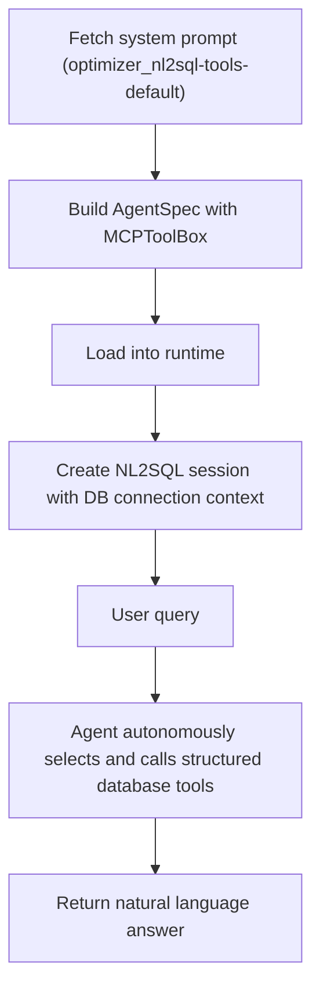

The NL2SQL agent enables natural language queries against structured data in Oracle Database.

- NL2SQL uses an **Agent** with dynamic MCP tool discovery — it autonomously decides which structured database tools to call using the ReAct pattern, rather than following a fixed pipeline.
- `build_nl2sql_agentspec` creates a portable AgentSpec Agent with an `MCPToolBox` that discovers available structured database tools at runtime.
- The session augments the agent's system prompt with the configured database connection name, model, and thread ID so the LLM passes them to the SQL execution tool calls.
- The system prompt is fetched from the MCP server (`optimizer_nl2sql-tools-default`). If unavailable, a default instruction is used.
- Requires a configured structured database connection.
